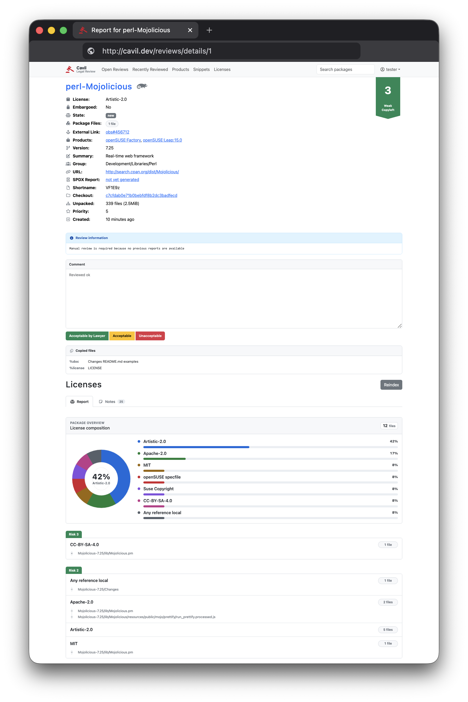

# [](https://github.com/openSUSE/cavil/actions) [](https://coveralls.io/github/openSUSE/cavil?branch=master)



  Cavil is a legal review and Software Bill of Materials (SBOM) system. It is used in the development of
  openSUSE Tumbleweed, openSUSE Leap, as well as SUSE Linux Enterprise.

## Features

* Source code legal review system for RPMs, DEBs, Tarballs and various other package formats
* High performance source code scanner with support for recursively decompressing almost any archive format
* 28.000 curated patterns for 2000 license combinations with 500 distinct [SPDX](https://spdx.dev) expressions
* Software Bill of Materials (SBOM) generation in SPDX 3.0.1 format, compliant with the EU Cyber Resilience Act (CRA)
  as specified by [BSI TR-03183-2](https://www.bsi.bund.de/dok/TR-03183-en)
* Detection of vendored/bundled subcomponents (npm, Cargo, PyPI, Maven, Go, Composer, NuGet, RubyGems) shipped inside
  packages, surfaced in the SBOM and the review report
* Package and component (purl) search, plus a component export, for supply-chain and vulnerability triage
* Legal risk assessments by lawyers for every pattern match
* Human reviews with approval/rejection workflow, and optional automatic approvals based on risk
* Optional support for machine learning models to classify pattern matches
* [MCP](https://modelcontextprotocol.io/) support for integration into AI assisted
  [legal review workflows](https://github.com/openSUSE/cavil/blob/master/docs/UserAPI.md#agent-skills)
* REST API for integration into existing source code management systems
* [Open Build Service](https://github.com/openSUSE/openSUSE-release-tools) and
  [Gitea](https://github.com/openSUSE/cavil-gitea) integration via bots
* OpenID Connect (OAuth 2.0) authentication

**Important**: Note that most of the data used by Cavil has been curated by lawyers, but the generated reports do not
count as legal advice and no guarantees are made for their correctness!


## Components

  This distribution contains the two main components of the system. A [Mojolicious](https://mojolicious.org) web
  application that lawyers can use to efficiently review package contents, and [Minion](https://metacpan.org/pod/Minion)
  background jobs to process and index packages, to create easy to digest license reports.

  Additionally there is large curated set of license patterns the SUSE lawyers have created included in this
  distribution. Currently this set consists of over 20000 patterns for all known Open Source licenses.

  The easiest way to connect OBS to Cavil is the `legal-auto.py` bot from the
  [openSUSE Release Tools](https://github.com/openSUSE/openSUSE-release-tools) repository. But you can also upload
  tarballs directly for analysis.

## AI

It is strongly recommended to combine Cavil with a machine learning model for text classification. Because the pattern
matching system used for identifying clusters of legal keywords (snippets) has a false-positive rate of about 80%. Even
a simple model can identify almost all of them.

The [openSUSE HuggingFace org](https://huggingface.co/openSUSE) has a collection of models fine-tuned specifically for
this task, such as `Cavil-Qwen3.5-4B`.

### Llama.cpp

The recommended deployment method for these models is a [llama.cpp](https://github.com/ggml-org/llama.cpp) server.

```
$ llama-server Cavil-Qwen3.5-4B.f16.gguf --host localhost --port 5000 --api-key TOKEN
```

Just start the server and add a `classifier` section like this to your `cavil.conf`.

```
classifier => {
  type  => 'llama_cpp',
  url   => 'http://localhost:5000',
  token => 'TOKEN'
}
```

### Legacy

Alternatively there are also two implementations for our legacy classifier API:

1. https://github.com/kraih/Character-level-cnn-pytorch/
2. https://github.com/kraih/llm-lawyer

## Getting Started

  The easiest way to get started with Cavil is the included staging scripts for setting up a quick development
  environment. All you need is an empty PostgreSQL database (with the `pgcrypto` and `pg_trgm` extensions
  activated) and the following dependencies:

```sh
    # Install dependencies
    sudo zypper in -C postgresql-server postgresql-contrib
    sudo zypper in -C perl-Mojolicious perl-Mojolicious-Plugin-Webpack \
      perl-Mojo-Pg perl-Minion perl-File-Unpack2 perl-Cpanel-JSON-XS \
      perl-Spooky-Patterns-XS perl-Mojolicious-Plugin-OAuth2 perl-Mojo-JWT \
      perl-BSD-Resource perl-Term-ProgressBar perl-Text-Glob perl-IPC-Run \
      perl-Try-Tiny perl-MCP perl-CommonMark perl-CryptX git git-lfs
    npm i

    # Build JavaScript assets
    npm run build
```

  Then use these commands to set up and tear down a development environment:

```sh
    # Initialize staging environment (remove --clean to include example fixtures)
    perl staging/start.pl --clean postgresql://tester:testing@/test

    # Start HTTP application server under http://127.0.0.1:3000
    CAVIL_CONF=staging/do_not_commit/cavil.conf morbo script/cavil

    # Start background job queue (separate process that does all the actual work)
    CAVIL_CONF=staging/do_not_commit/cavil.conf script/cavil minion worker

    # Tear down staging environment once you are done
    perl staging/stop.pl
```

## Documentation

For more information see the included [documentation](/docs).

## Acknowledgements

Cavil bundles and builds upon license data from third parties, including the
[ScanCode LicenseDB](https://scancode-licensedb.aboutcode.org/) (CC-BY-4.0) and the
[SPDX License List](https://spdx.org/licenses/). See the [NOTICE](NOTICE) file for the full attributions and their
licenses.
